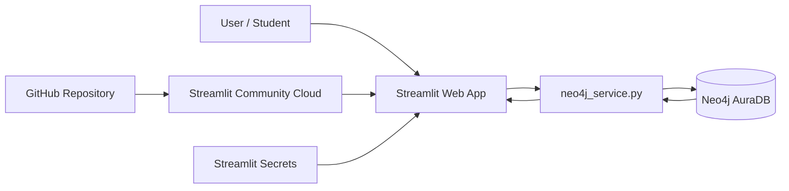
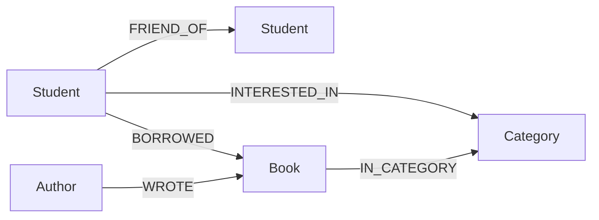

# คู่มือสร้างระบบแนะนำหนังสือด้วย Neo4j Aura + Streamlit

## 1) เป้าหมายการเรียนรู้

เมื่อทำโปรเจ็คนี้เสร็จ นักศึกษาควรสามารถ

1. ออกแบบ Property Graph จากโจทย์ระบบจริง
2. อธิบาย Node, Label, Property, Relationship และ Direction
3. เขียน Cypher สำหรับ CRUD, traversal และ aggregation
4. เชื่อม Python กับ Neo4j Aura ด้วย official Neo4j Python Driver
5. สร้าง Explainable Recommendation จากความสัมพันธ์ในกราฟ
6. พัฒนา Web UI ด้วย Streamlit
7. แยก secret/credential ออกจาก source code
8. deploy ระบบจาก GitHub ไป Streamlit Community Cloud

---

## 2) สถาปัตยกรรมระบบ



แยกเป็น 4 ชั้น

- **Presentation layer:** `app.py`
- **Database access layer:** `neo4j_service.py`
- **Graph database:** Neo4j AuraDB
- **Deployment/configuration:** GitHub + Streamlit Community Cloud + Secrets

---

## 3) Graph Data Model



### Node

| Label | Primary property | ตัวอย่าง property | หน้าที่ |
|---|---|---|---|
| Student | student_id | name, major, year | ผู้ใช้ระบบ |
| Book | book_id | title, year | หนังสือ |
| Category | name | name | หมวดหนังสือ |
| Author | author_id | name | ผู้แต่ง |

### Relationship

| Relationship | Source → Target | Property | ความหมาย |
|---|---|---|---|
| FRIEND_OF | Student → Student | - | ความสัมพันธ์เพื่อน |
| BORROWED | Student → Book | borrow_date, rating | ประวัติยืมและคะแนน |
| INTERESTED_IN | Student → Category | - | ความสนใจ |
| IN_CATEGORY | Book → Category | - | หมวดหนังสือ |
| WROTE | Author → Book | - | ผู้แต่งหนังสือ |

> `FRIEND_OF` ถูกสร้างเพียงหนึ่ง relationship ต่อคู่ แต่ query แบบ `-[:FRIEND_OF]-` เมื่อความหมายของงานต้องการมองว่าเป็นเพื่อนแบบสมมาตร

---

## 4) เหตุผลที่ Graph Database เหมาะกับโจทย์นี้

ใน RDBMS การหา “หนังสือที่เพื่อนของนักศึกษาเคยยืม แต่เจ้าตัวยังไม่เคยยืม” มักต้อง JOIN หลายตาราง เช่น Student, Friendship, Borrow และ Book

ใน Graph สามารถเขียนเป็น pattern ได้ใกล้เคียงกับโจทย์โดยตรง

```cypher
MATCH (u:Student {student_id:$student_id})
      -[:FRIEND_OF]-(friend:Student)
      -[:BORROWED]->(book:Book)
WHERE NOT (u)-[:BORROWED]->(book)
RETURN book
```

จุดสำคัญคือเรา query **ความสัมพันธ์และเส้นทาง** ไม่ได้มองเฉพาะ record แยกตาราง

---

## 5) Recommendation Algorithm

ระบบใช้ Hybrid Heuristic Recommendation เพื่อให้เข้าใจง่ายในระดับปริญญาตรี

### Signal 1: Social

จำนวนเพื่อนที่เคยยืมหนังสือเล่มนั้น

```text
social_score = friend_count × 3
```

### Signal 2: Interest / Content

จำนวนหมวดของหนังสือที่ตรงกับความสนใจผู้ใช้

```text
interest_score = interest_matches × 2
```

### Signal 3: Popularity

จำนวนครั้งที่หนังสือถูกยืมโดยนักศึกษาทั้งระบบ

```text
popularity_score = popularity × 0.20
```

### Signal 4: Rating

คะแนนเฉลี่ยจาก relationship `BORROWED.rating`

```text
rating_score = average_rating × 0.50
```

### Final score

```text
score = social_score
      + interest_score
      + popularity_score
      + rating_score
```

และตัดหนังสือที่ผู้ใช้เคยยืมแล้วออกด้วย

```cypher
WHERE NOT (u)-[:BORROWED]->(b)
```

สูตรนี้มีเป้าหมายเพื่อสอนแนวคิด recommendation และ graph traversal ไม่ได้อ้างว่าเป็นสูตรที่เหมาะที่สุดในเชิงวิจัย

---

## 6) Explainable Recommendation

ระบบไม่ได้คืนเพียง title และ score แต่คืน evidence ด้วย เช่น

- เพื่อนกี่คนเคยยืม
- เพื่อนชื่ออะไร
- ตรงกับหมวดความสนใจใด
- หนังสือถูกยืมกี่ครั้ง
- rating เฉลี่ยเท่าใด

ตัวอย่างคำอธิบายบน UI

```text
เพื่อน 2 คนเคยยืม (Mali, Krit)
• ตรงกับความสนใจ 1 หมวด (Data Science)
• ถูกยืมแล้ว 3 ครั้ง
• คะแนนเฉลี่ย 4.67/5
```

นี่เป็นข้อดีเชิงการเรียนรู้ เพราะนักศึกษาสามารถ trace กลับไปยัง graph pattern ที่ทำให้เกิดคำแนะนำได้

---

## 7) Constraint และเหตุผลที่ต้องใช้ MERGE

สร้าง key ของ node ให้ unique

```cypher
CREATE CONSTRAINT student_id_unique IF NOT EXISTS
FOR (s:Student) REQUIRE s.student_id IS UNIQUE;
```

การ seed ตัวอย่างใช้ `MERGE`

```cypher
MERGE (s:Student {student_id: row.student_id})
SET s.name = row.name
```

ข้อดีคือใช้ `student_id` เป็นตัวระบุ node เดิมก่อนสร้างใหม่ ทำให้ script ตัวอย่างสามารถรันซ้ำได้โดยไม่เพิ่ม Student เดิมเป็นหลาย node

---

## 8) Parameterized Cypher

ไม่ควรเขียน

```python
cypher = "MATCH (s:Student {student_id:'" + student_id + "'}) RETURN s"
```

ควรเขียน

```python
cypher = "MATCH (s:Student {student_id:$student_id}) RETURN s"
params = {"student_id": student_id}
```

แล้วส่ง parameter ผ่าน Neo4j Driver ซึ่งทำให้โค้ดอ่านง่ายและหลีกเลี่ยงการนำ input ไปประกอบ query string โดยตรง

---

## 9) การเชื่อมต่อ Neo4j Aura

`neo4j_service.py` สร้าง `Driver` เพียงหนึ่งตัวและ cache ด้วย `@st.cache_resource`

```python
@st.cache_resource(show_spinner=False)
def get_driver():
    driver = GraphDatabase.driver(uri, auth=(username, password))
    driver.verify_connectivity()
    return driver
```

จากนั้น query ด้วย `driver.execute_query()` พร้อมระบุ database และ parameter

```python
records, _, _ = driver.execute_query(
    cypher,
    parameters_=parameters,
    database_=database,
)
```

---

## 10) หน้าจอของระบบ

### Dashboard

- จำนวน Student
- จำนวน Book
- จำนวน BORROWED
- จำนวน FRIEND_OF
- profile และประวัติยืม

### Recommendations

- เลือก Student
- กำหนด Top-N
- แสดง score
- แสดงเหตุผลประกอบคำแนะนำ

### Book Search

- ค้นจากชื่อหนังสือ
- ค้นจากผู้แต่ง
- filter จาก Category

### Borrow / Rate

- เลือก Student
- เลือก Book
- บันทึก borrow_date
- บันทึก rating

### Graph Explorer

- แสดง neighborhood graph ของ Student
- ใช้ relationship จริงจาก Aura
- เปิดดู edge table ได้

### Admin / Setup

- สร้าง constraints
- seed sample nodes/relationships
- ใช้ `MERGE` เพื่อรองรับการรันซ้ำ

---

## 11) Secrets

สร้าง local file

```text
.streamlit/secrets.toml
```

เนื้อหา

```toml
[neo4j]
uri = "neo4j+s://YOUR_INSTANCE.databases.neo4j.io"
username = "neo4j"
password = "YOUR_PASSWORD"
database = "neo4j"
```

ห้าม commit ไฟล์นี้ขึ้น GitHub โดย `.gitignore` ของโปรเจ็คเตรียมไว้แล้ว

---

## 12) GitHub

ตัวอย่างคำสั่ง

```bash
git init
git add .
git commit -m "Initial GraphBook recommender"
git branch -M main
git remote add origin YOUR_GITHUB_REPOSITORY_URL
git push -u origin main
```

ก่อน push ตรวจอีกครั้งว่า `.streamlit/secrets.toml` ไม่อยู่ใน staged files

```bash
git status
```

---

## 13) Deploy Streamlit Community Cloud

1. เปิด Streamlit Community Cloud
2. Create app
3. เลือก GitHub repository
4. branch = `main`
5. main file = `app.py`
6. Advanced settings → Secrets
7. paste ค่า `[neo4j] ...`
8. Deploy

เมื่อ app เริ่มทำงานจะติดตั้ง package ตาม `requirements.txt`

---

## 14) ลำดับ Lab ที่แนะนำ

### Lab 1 — Graph Model
ให้นักศึกษาวาด Node/Relationship ก่อนเขียนโปรแกรม

### Lab 2 — Seed Data
สร้าง constraint และใช้ `UNWIND + MERGE`

### Lab 3 — Basic Cypher
`MATCH`, `WHERE`, `RETURN`, `ORDER BY`

### Lab 4 — Traversal
หา Book ผ่าน Friend

### Lab 5 — Aggregation
ใช้ `count(DISTINCT friend)`, `avg(rating)`, `collect()`

### Lab 6 — Recommendation
รวมหลาย signal เป็น score

### Lab 7 — Python Driver
เรียก Cypher จาก Python แบบ parameterized

### Lab 8 — Streamlit
สร้าง UI และ state จาก widget

### Lab 9 — Deployment
GitHub + Secrets + Streamlit Cloud

### Lab 10 — Evaluation / Extension
ให้นักศึกษาปรับ weight หรือเพิ่ม algorithm แล้วเปรียบเทียบผล

---

## 15) แนวทางต่อยอดเป็น Mini Project / Senior Project

1. Authentication และ Role: Student/Admin
2. Favorite / Wishlist
3. RETURNED, RESERVATION และ due date
4. book availability
5. friend suggestion
6. User-to-user similarity
7. Book-to-book similarity
8. Neo4j Graph Data Science
9. PageRank / community detection
10. Precision@K, Recall@K, NDCG@K
11. A/B comparison ระหว่าง Social-only, Content-only และ Hybrid
12. Explainability study ว่าผู้ใช้เชื่อถือ recommendation มากขึ้นหรือไม่เมื่อเห็นเหตุผล

---

## 16) จุดที่แก้จาก notebook ต้นแบบ

Notebook เดิมมีแนวคิดที่ดีสำหรับ traversal `Student → Friend → Borrowed → Book` แต่เมื่อนำไปทำระบบจริงจำเป็นต้องทำให้ schema และ execution reproducible มากขึ้น จึงปรับดังนี้

- ใช้ `Student` label เดียวทั้งระบบ
- constraint อ้าง `Student` ไม่ใช่ label คนละชื่อ
- seed ด้วย `MERGE` แทน `CREATE`
- relationship query ของ Friend ใช้ traversal แบบไม่สน direction
- credential แยกออกจาก source code
- เพิ่ม Category/Author/Interest
- เพิ่ม Borrow rating
- เพิ่ม hybrid recommendation
- เพิ่ม explanation
- แยก UI กับ database service
- เพิ่ม deployment files สำหรับ GitHub/Streamlit Cloud

ผลคือโค้ดเหมาะกับการสอนตั้งแต่ Graph Modeling จนถึง Web Deployment และสามารถต่อยอดเป็นโครงงานระดับปริญญาตรีได้
